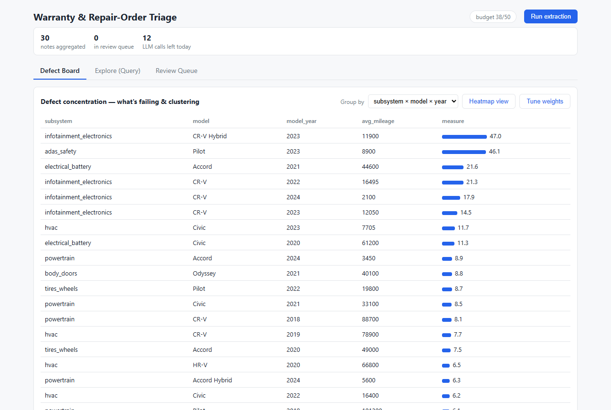
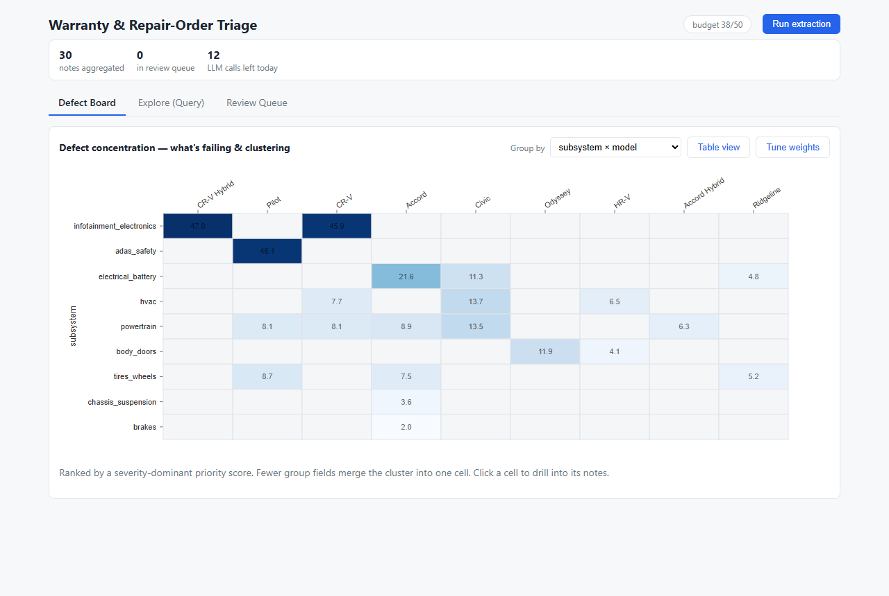
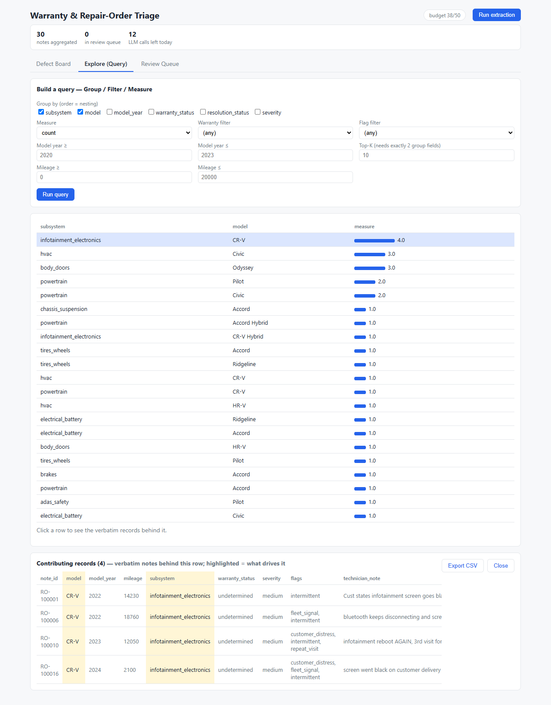
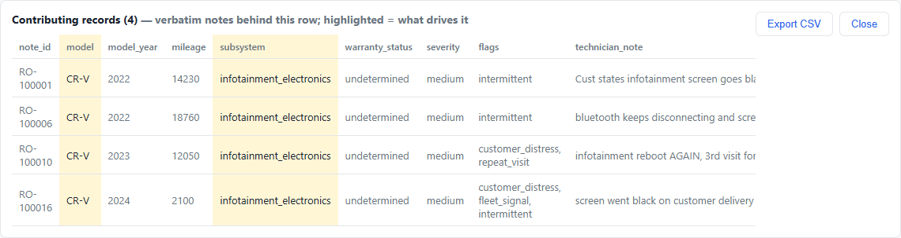
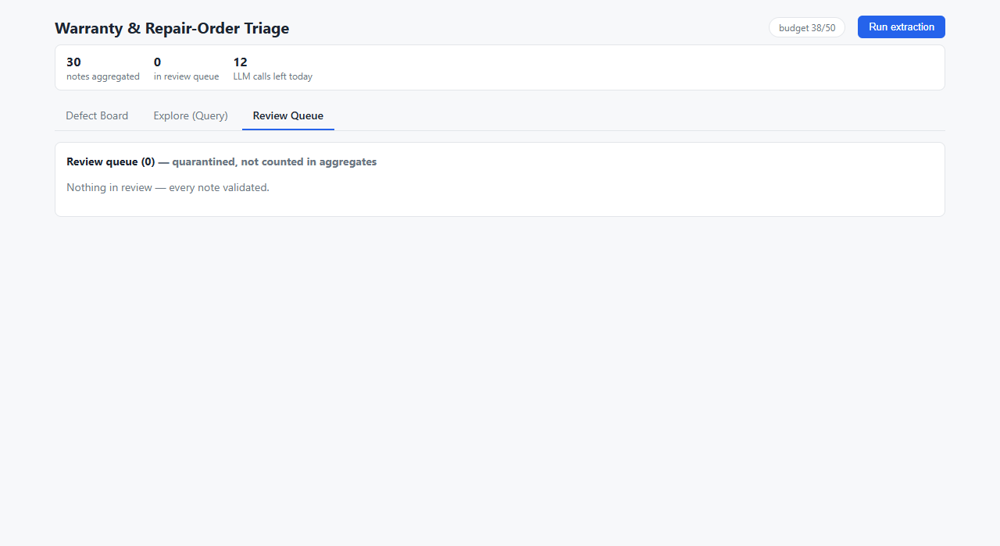

# Warranty & Repair-Order Triage

Turn a batch of free-text dealership repair notes into an **analyst decision surface**: what's failing,
how serious, whether it's covered under warranty — with every number traceable back to the verbatim note
that produced it.

**How it works in one line:** an LLM structures each note against a versioned schema (one call per note,
cached to S3 so re-runs are free), DuckDB aggregates the structured records deterministically, and a React
dashboard surfaces the defect concentrations — no LLM anywhere in the analytics path.

---

## Quickstart (clean clone → running app)

Prereqs: **Docker** (with Compose) and a free **OpenRouter API key** ([openrouter.ai/settings/keys](https://openrouter.ai/settings/keys) — no credit card).

**1. Add your API key** — the only configuration step:
```bash
cd warranty-repair-triage           # the unzipped archive (or a fresh clone)
cp .env.example .env                # then edit .env and set OPENROUTER_API_KEY=sk-or-<your key>
```
Leave every other value in `.env` as-is — the AWS entries are **LocalStack dummies** (AWS is emulated
locally; no AWS account or credentials are needed).

**2. Start the whole application with one command:**
```bash
docker compose up --build
```
This builds and starts, in order: **LocalStack** (emulated S3) → **backend** (FastAPI — waits for
LocalStack to be healthy) → **frontend** (the dashboard). The first build pulls base images, so allow a
few minutes.

**3. Open http://localhost:3000 and click “Run extraction.”** What you'll see:
- the button switches to **“Extracting… x/30”**, and a **progress banner with a bar** appears —
  *“Extracting notes — x of 30 processed · n served from cache · m sent to review”*;
- the **Defect Board fills in live** as records land (the view refreshes every few records);
- the full batch takes **~2–3 minutes** under the free-tier rate limit and uses **~30–40 of your 50
  daily free calls**. When it completes, the **CR-V infotainment cluster ranks #1** on the board.

**4. Explore.** The dashboard tour below explains each view; the auto-generated API reference is at
**http://localhost:8000/docs**.

**Re-runs are free.** Every extraction is cached in S3 keyed by `schema_version + note_sha256`; restarting
the backend or clicking “Run extraction” again costs **zero** LLM calls (the daily budget ledger also lives
in S3). One caveat: **LocalStack Community keeps S3 state in memory**, so restarting the *LocalStack
container* resets the demo data — just click “Run extraction” again (against real AWS S3 this limitation
disappears entirely).

**Resetting the demo (optional):** wipe the extraction cache and rebuild from scratch with
`docker compose exec localstack awslocal s3 rm s3://repair-triage --recursive` (or just
`docker compose restart localstack`), then click “Run extraction” again.

**Adding your own notes (optional):** append rows to `data/repair_notes_sample.csv` (same columns:
`note_id, date, model, model_year, mileage, technician_note`), then — **important — click “Run
extraction” again; new rows are not picked up automatically.** Already-extracted notes are cache hits
(**zero** LLM calls), so only the new or edited rows are sent to the LLM (one call each from your daily
quota), and the dashboard updates live as they land.

- **`note_id` is the record's identity — keep it unique.** Re-using an existing id never breaks the run:
  a row whose id *and* text match an existing record is simply skipped as a free cache hit; if the text
  differs, it's treated as an **edit** — re-extracted, replacing the old record.
- **Running out of provider quota mid-batch is safe:** affected notes are reported on the progress banner
  as *“hit provider limits — will retry free on the next run”*, are **not** cached, and are picked up
  automatically the next time you click “Run extraction”. The run itself never fails.

Environment variables (see [.env.example](.env.example)): `OPENROUTER_API_KEY` (required),
`OPENROUTER_BASE_URL`, `LLM_MODEL`, `LLM_PROVIDER`, `AWS_ENDPOINT_URL`, `S3_BUCKET`, budget caps.
Everything environment-specific is env-driven — no hardcoded endpoints, models, or keys.

---

## The dashboard (what you're looking at)

### 1 — Defect Board: *what's failing & clustering*


The headline view: notes grouped into cells (default `subsystem × model × model_year`), ranked by a
**severity-dominant priority score** — one serious, recent, safety-flagged failure outranks a pile of
trivial ones. Each cell shows its **average mileage** (the CR-V infotainment failures cluster at 2k–16k
miles — near-new vehicles). The **Group by** selector changes granularity; **Tune weights** exposes the
full scoring formula (transparent, tunable, reset-to-default). Click any row to drill into the verbatim
notes with the model's `evidence_quote` highlighted.



The **heatmap view** re-renders any 2-field grouping as a matrix — dark cells = concentrations. Same data,
same click-to-drill.

### 2 — Explore: *ask your own question*


A query builder over one aggregation grammar: pick **group-by** fields, a **measure**
(`count` / `priority` / `severity_index` / `avg_mileage`), **filters** (warranty, flags, model-year and
mileage ranges), and optional **top-K**.

**Every number is auditable — click any listed row (statistic) to see exactly which records produced it:**



Clicking a result row opens **Contributing records** — the verbatim technician notes behind that
statistic (respecting all active filters), with the fields that put each record in the statistic and
that drive the measure **highlighted**; a row expands to full detail with the model's `evidence_quote`
highlighted inside the source text, and the set exports to **CSV**. The same pattern applies on the
Defect Board: click any cell → *“Notes in this cell”* with per-note evidence highlighting.

### 3 — Review Queue: *the honesty surface*


Extractions that failed validation or came back low-confidence are **quarantined here and excluded from
all aggregates by default** — the tool never counts what it isn't sure of. Each entry shows exactly *why*
it's in review (e.g. the model omitted a required field). *(This capture shows a clean run — 30/30
validated. The free router varies: another run put 2 notes here with `'complaint_summary' is a required
property` as the recorded reason — the guardrail in action.)*

---

## Architecture

```
data/repair_notes_sample.csv
        │  POST /extract/run  (batch, cache-first)
        ▼
┌─ FastAPI backend ──────────────────────────────────────────────┐
│  cache-check ── hit ──────────────────────────────┐            │
│      │ miss                                        │            │
│      ▼                                             ▼            │
│  OpenRouter LLM (1 call/note, schema-constrained) S3 (LocalStack)
│      ▼                                             ▲            │
│  validate: jsonschema + evidence-quote substring ──┘            │
│      │  (fail → retry ≤1 → needs_review)      extractions/{id}.json
│      ▼                                        _budget/{day}.json │
│  DuckDB in-memory view  ◄── rebuilt from S3 on startup          │
│      ▲                                                          │
│  POST /aggregate  (query object → parameterized SQL)            │
└──────┼──────────────────────────────────────────────────────────┘
       │ JSON
       ▼
React dashboard (board · explore · review) — a thin renderer, no analytics in the browser
```

**Key design decisions** (each is a 1-page ADR in [docs/decisions/](docs/decisions/)):

| Decision | Why |
|---|---|
| **Schema-driven extraction** — one versioned contract ([schema/](schema/)) drives the prompt, the structured-output constraint, *and* the response validator | fields are never hardcoded; swap the schema file and the whole pipeline retargets ([ADR-0004](docs/decisions/0004-prompt-design.md)) |
| **S3 is load-bearing** — cache (restart = 0 LLM calls), daily budget ledger, audit trail with per-record provenance (`model`, `prompt_version`, `git_sha`) | the 50-calls/day free tier makes cache-first mandatory, and analysts need auditability ([ADR-0002](docs/decisions/0002-s3-key-layout-and-provenance.md)) |
| **Warranty is a 4-state spectrum** (`covered/denied/undetermined/not_applicable` + denial reason), never a boolean | ~⅔ of notes carry no explicit determination; *in-warranty ≠ covered* |
| **Uncertainty contract** — unsupported fields are `undetermined`/`null`, never guessed; `evidence_quote` must be a verbatim substring of the note (deterministic anti-hallucination check) | LLM output is treated as untrusted input |
| **Aggregation = one grammar** — every view (presets, query panel, charts) emits the same query object, compiled to parameterized DuckDB SQL against a whitelist | one engine, no divergent code paths, no SQL injection, zero LLM in analytics ([ADR-0006](docs/decisions/0006-aggregation-grammar-duckdb.md)) |
| **Severity-dominant, tunable priority score** | one `critical` should outrank many `low`s; the score is the tool's only imposed opinion, so it's transparent, tunable, and resettable ([ADR-0005](docs/decisions/0005-aggregate-first-dashboard.md)) |
| **Provider seam** — `LLM_PROVIDER=openrouter\|bedrock\|vllm` behind one interface | config-only portability: free router now, Bedrock Claude at scale, self-hosted vLLM optionally ([ADR-0007](docs/decisions/0007-provider-ladder-seam.md)) |

---

## Assumptions & decisions (where the brief was silent)

1. **“Make sense of a batch” → aggregation-first.** The analyst's pain is *emerging defects noticed late*,
   so the product is a ranked defect board, not a note reader. (The sample data rewards this: 5 CR-V
   infotainment notes, MY2022–24, low mileage, escalating to a backup-camera safety concern — the board
   surfaces this cluster immediately.)
2. **Severity is an LLM judgment, calibrated and audited.** Few-shot anchors pin the ordinal scale;
   six deterministic boolean flags (`safety_related`, `repeat_visit`, `intermittent`, …) provide
   cross-checkable evidence behind it.
3. **Trusted CSV fields are never sent to the LLM** (`note_id/date/model/model_year/mileage`) — no
   hallucination surface for known facts, and no temptation to infer warranty coverage from mileage.
4. **Incomplete extractions are quarantined, not counted.** `needs_review` rows render in the Review Queue
   and are excluded from aggregates by default.
5. **Schema evolution is monotonic** — new enum values / optional fields only, so cached records stay
   valid; a version bump transparently forces re-extraction (cache key includes `schema_version`).
6. **Recency is measured against the dataset's own date span** (not wall-clock “today”) so scores are
   deterministic and testable; a production stream would anchor to now.

**Questions we'd have asked a stakeholder** (assumption made in place of each): Can notes be linked by VIN
(assumed no → `repeat_visit` inferred from note text)? Does a canonical parts taxonomy exist (assumed no →
subsystem enum mined from the corpus, free-text `component_mention` kept as the mapping seam)? Is there an
official abbreviation glossary (assumed no → LLM + semantic descriptions handle shorthand)? What's the
warranty adjudication source of truth (assumed the note's own statement; absent → `undetermined`)?

---

## Documentation beyond this README

The docs are modular and **self-composing** — [docs/README.md](docs/README.md) is both the map (every doc:
role, reader, change-rate) and a load-bearing instruction that lets any LLM assemble the full project
narrative from the parts. Highlights: [docs/decisions/](docs/decisions/) (ADRs — the *why*),
[docs/sdd.md](docs/sdd.md) (the *how*), [schema/schema_spec.yaml](schema/schema_spec.yaml) (the contract,
with per-enum semantics the runtime also consumes), and [LLM-USAGE.md](LLM-USAGE.md) (AI-tool disclosure).

### Build the documentation with any LLM (the documentation-builder)

The documentation is designed to be *compiled on demand*: zip this repository (or just the `docs/` +
`schema/` folders), upload it to any capable LLM (Claude, ChatGPT, Gemini, …), and prompt it — the
compose recipe the model should follow ships inside [docs/README.md](docs/README.md) §3, including the
reading order, source-of-truth rules, and figure guidance. Template prompts:

| Goal | Prompt |
|---|---|
| **Full narrative** | *“Read `docs/README.md` and follow its §3 compose instructions over this archive. Produce the complete project documentation, with an architecture diagram (mermaid) and the screenshots from `docs/screenshots/` embedded where relevant.”* |
| **Executive overview** | *“Follow `docs/README.md` §3 and compose a one-page executive overview: the business problem, the approach, the five key design decisions, and the result.”* |
| **Deep-dive on one part** | *“Follow `docs/README.md` §3, focusing on the aggregation engine (ADR-0006 + SDD §7.1): explain the query grammar, how it compiles to SQL, and its injection-safety model. Include a request-flow diagram.”* |
| **The build process** | *“Follow `docs/README.md` §3 and reconstruct the build chronologically from `docs/*-notes.md`: the decisions, the pivots, and the bugs found in live verification and how they were fixed.”* |
| **Evaluation lens** | *“Follow `docs/README.md` §3 and summarize how this project addresses: runs-as-documented, judgment under ambiguity, technical & AI depth, cloud reasoning, and communication.”* |

## Tests

Deterministic, no-LLM, no-Docker:

```bash
python -m venv .venv && .venv/Scripts/pip install -r backend/requirements.txt   # (or .venv/bin/pip on mac/linux)
.venv/Scripts/python tests/test_aggregate.py
```

Five assertions over fixture records, including *the planted CR-V infotainment cluster ranks #1* and
*needs_review rows are excluded from aggregates*.

---

## Shortcuts taken (and what I'd change for production)

| Shortcut (deliberate, prototype-scoped) | Production change |
|---|---|
| In-memory DuckDB behind a `threading.Lock` (a concurrency bug caught in live browser testing) | connection pool; DuckDB over Parquet-on-S3 (`httpfs`) or Athena |
| Budget ledger is S3 read-modify-write (single writer) | DynamoDB atomic counter |
| Per-process rate throttle | SQS + reserved consumer concurrency |
| Drill-down filtering happens client-side | dedicated `/records` endpoint with server-side filters |
| Dev CORS regex (any localhost port) | explicit allowed origins |
| Free-router model variance: depending on which model the router picks, a run may send a few notes to the review queue (e.g. a missing required field) — we observed 0–2 of 30 across runs; the quarantine handles it | stronger model via the provider seam (Bedrock Claude) — pipeline unchanged |
| Async ingest (SQS workers + live progress) designed ([ADR-0008](docs/decisions/0008-async-ingest-pipeline.md)) but **not built** — deliberate scope cut | build the queue consumer path; it's the same `extract()` behind `POST /ingest` |
| No auth / accounts / multi-tenancy | out of scope per the brief |

---

## Scaling & real-AWS deployment plan

The same code targets real AWS by **changing config only**: unset `AWS_ENDPOINT_URL` (boto3 then hits real
S3) and supply IAM credentials — the client code is identical (path-style addressing is harmless on real S3).

| Prototype (LocalStack) | Real AWS |
|---|---|
| LocalStack S3 | **S3** (records + ledger + audit; lifecycle to Glacier for audit retention) |
| LocalStack SQS (reserved) | **SQS** ingest queue + DLQ for poison notes |
| Synchronous `/extract/run` | **SQS → Lambda/ECS consumers**, idempotent (the S3 cache-check dedups), reserved concurrency = the rate limit |
| S3 JSON read-modify-write ledger | **DynamoDB** atomic counters (per-day budget, per-provider) |
| In-memory DuckDB view | **DuckDB over Parquet on S3** via `httpfs` (same SQL, no full load), or Athena at warehouse scale |
| FastAPI container | **ECS Fargate / App Runner** behind an ALB |
| nginx static frontend | **S3 + CloudFront** |
| OpenRouter free router | **Amazon Bedrock (Claude)** via the existing `LLM_PROVIDER=bedrock` seam — boto3 `converse`, cross-region inference profile |

**Throughput story:** extraction is the bottleneck (LLM-bound, rate-limited); analytics scales for free
(deterministic SQL over columnar data). At 1,000 notes/day: notes land in SQS, idempotent consumers extract
under provider rate limits and write to S3; the analytics layer reads Parquet directly — adding records
under a **fixed schema is seamless** (validate → cache → next query includes them); only a schema *version
bump* forces re-extraction, by design.

**What I'd do next** (in order): the async ingest pipeline (ADR-0008, enables live 1000-record demos),
the Bedrock adapter (credentials + `us.` inference profile already verified), then a natural-language
ask-layer over the same `/aggregate` engine.

---

## LLM usage

AI-assisted development is disclosed in [LLM-USAGE.md](LLM-USAGE.md). At runtime the LLM is used in
exactly one place — turning a note into a schema-shaped record at ingest. Everything the analyst sees is
deterministic.

---

*© 2026 Sunit Singh. Created solely for Honda's candidate-evaluation process and shared for evaluation
purposes only; all other rights reserved (see [NOTICE](NOTICE)).*
